# YouTube Archiver

**YouTube Archiver** is a command-line tool that downloads videos, metadata, and transcripts from specified YouTube channels. It aims to provide an efficient way to maintain local, up-to-date copies of YouTube videos from user-defined sources. It uses the following key Python libraries:

- [yt-dlp](https://github.com/yt-dlp/yt-dlp) for downloading videos and their metadata.
- [tqdm](https://github.com/tqdm/tqdm) for progress bars.
- [asyncio](https://docs.python.org/3/library/asyncio.html) for parallel, asynchronous operations.
- [httpx](https://www.python-httpx.org/) for potential asynchronous HTTP operations (if extended).
- [logging](https://docs.python.org/3/library/logging.html) for detailed logs.

## Table of Contents

1. [Project Structure](#project-structure)
2. [Installation](#installation)
3. [Configuration](#configuration)
4. [Usage](#usage)
5. [Program Flow](#program-flow)
6. [Architectural Diagram](#architectural-diagram)
7. [Advanced Topics](#advanced-topics)
8. [License](#license)

---

## Project Structure

```text
youtube_archiver/
├── youtube_archiver
│   ├── __init__.py          # Package initialization
│   ├── config.py            # Configuration loading and parsing
│   ├── logger.py            # Logging setup
│   ├── downloader.py        # Download logic, concurrency, aspect ratio filtering
│   ├── main.py              # Main CLI entry point
└── README.md                # Project documentation
```

---

## Installation

1. **Clone or download** this repository.

2. **Create a virtual environment** (recommended):
   ```bash
   python3.10 -m venv venv
   source venv/bin/activate
   ```

3. **Install the required packages**:
   ```bash
   pip install yt-dlp tqdm httpx
   ```
   This project is designed and tested with **Python 3.10**.

---

## Configuration

The program expects a JSON configuration file, for example:
```json
{
  "channels": [
    {
      "url": "https://www.youtube.com/@LinusTechTips",
      "download_directory": "/path/to/videos/linustechtips"
    },
    {
      "url": "UCXuqSBlHAE6rF5ibm3vjYRA",
      "download_directory": "/mnt/media/youtube/some_other_dir"
    },
    {
      "url": "TheVerge"
    }
  ],
  "default_directories": [
    "/default/path/for/channels/without/specific/directory"
  ]
}
```

- **channels**: A list of channel entries. Each entry has:
  - **url**: Can be a full YouTube URL, a channel handle (e.g., `@SomeChannel`), or a channel ID (starting with `UC`...).
  - **download_directory** (optional): A specific output directory. If not present, a path from `default_directories` will be used.
- **default_directories**: A list of fallback directories if no `download_directory` is provided for a channel.

### Cookie Authentication (Optional)

In some cases, YouTube may require you to "Sign in to confirm you’re not a bot" when accessing channel data or videos, especially if you are making frequent requests. To bypass this, you can provide a cookies file to the archiver. This allows `yt-dlp` to authenticate with YouTube using your browser cookies, just like you were logged in.

**1. Obtain Cookies from Your Browser:**

   You'll need to export cookies from your web browser while you are logged in to your YouTube account.  There are several browser extensions available that can help you export cookies in a format that `yt-dlp` can understand (e.g., Netscape or cookies.txt format).

   **Recommended Browser Extensions:**

   *   **Chrome:** "EditThisCookie", "Cookie-Editor" (export to cookies.txt or Netscape format)
   *   **Firefox:** "Export Cookies.txt", "Cookie Quick Manager" (export to cookies.txt or Netscape format)

   **General Steps:**

   1.  Install a cookie export extension in your browser.
   2.  Log in to your YouTube account on YouTube.com in your browser.
   3.  Use the cookie export extension to export your cookies. Save the cookies to a `.txt` file (e.g., `youtube_cookies.txt`).  Make sure to export in a format like "Netscape" or "cookies.txt" if the extension offers format options.

**2. Configure `cookies_file` in `config.json`:**

   Add the `"cookies_file"` option to your `config.json` and specify the path to your exported cookies file.

   ```json
   {
     "channels": [
       // ... your channel configurations ...
     ],
     "default_directories": [
       // ... your default directories ...
     ],
     "cookies_file": "/path/to/your/youtube_cookies.txt"  // <-- Add this line
   }
   ```

   *   Replace `/path/to/your/youtube_cookies.txt` with the actual path to the cookies file you exported.
   *   **Important:** Store your cookies file in a secure location and ensure the path in `config.json` is correct.

**3. Run the Archiver:**

   When you run the YouTube Archiver with the updated `config.json`, it will automatically use the provided cookies for authentication. This should help you avoid "Sign in" prompts and potentially access age-restricted or member-only content (though member-only content download is not explicitly supported yet).

**Note:**

*   Cookies expire. You may need to refresh your cookies periodically by re-exporting them from your browser if you start encountering authentication issues again.
*   Do not share your cookies file with untrusted parties, as it can grant access to your YouTube account.

---

## Usage

Run the **YouTube Archiver** from the root of the project:

```bash
python -m youtube_archiver.main --config /path/to/config.json
```

Options:
- `--config` / `-c`: Path to the JSON configuration file. (**required**)
- `--max-concurrent`: Maximum number of videos to download in parallel. (default: 3)
- `--rate-limit`: Number of seconds to sleep after **each** successful download to respect rate limits. (default: 5, meaning 5 second delay)

Example:
```bash
python -m youtube_archiver.main \
  --config /path/to/config.json \
  --max-concurrent 5 \
  --rate-limit 2
```

---

## Program Flow

1. **Load Configuration**  
   The program reads and validates the JSON configuration file specified by `--config`.

2. **Initialize Logger**  
   A logger is set up to record both to the console and to a time-stamped log file under a `logs/` directory.

3. **Process Each Channel**  
   For each entry in the `channels` array:
   1. Resolve the channel URL to a proper YouTube "videos" page if necessary.
   2. Determine the output directory from either `download_directory` or the first `default_directories` entry.
   3. Extract the list of videos from the channel via **yt-dlp** in "extract_flat" mode.
   4. **Parallel Download**:  
      - For each video, the tool checks its aspect ratio (if metadata is available). **9:16 videos are skipped** as required.
      - The video is downloaded (including metadata and transcripts) if it has not been downloaded previously.
      - Each download operation can retry up to **3 times** on failure.

4. **Wrap Up**  
   After all channels and their videos have been processed, the program prints a summary message and exits.

---

## Architectural Diagram

```mermaid
flowchart LR
    A[Start] --> B[Load JSON Config]
    B --> C[Setup Logger]
    C --> D[For each channel in config]
    D --> E[Resolve Channel URL & Directory]
    E --> F[List Channel Videos with yt-dlp]
    F --> G[Parallel Download with Aspect Ratio Check]
    G --> H[Retry up to 3 times on failure]
    H --> I[Log progress & errors]
    I --> J[Next channel]
    J --> K[End]
```



- **Parallel Download** uses `asyncio` with a semaphore to limit the number of concurrent tasks.  
- Each video is processed independently, ensuring that one failure does not halt the entire operation.

---

## Advanced Topics

- **Caching**  
  By default, yt-dlp caching is enabled within each `download_directory` (`.cache` folder). This avoids redundant data fetching.
- **Rate Limit Handling**  
  If you specify `--rate-limit 2`, for example, the program will sleep 2 seconds after **each** successful download. This helps avoid potential blocking from YouTube’s servers.

---

## License

This project is provided as-is, without any specific license included. You may use and modify it for personal or internal business needs.  
Feel free to adapt and improve as required by your workflow.